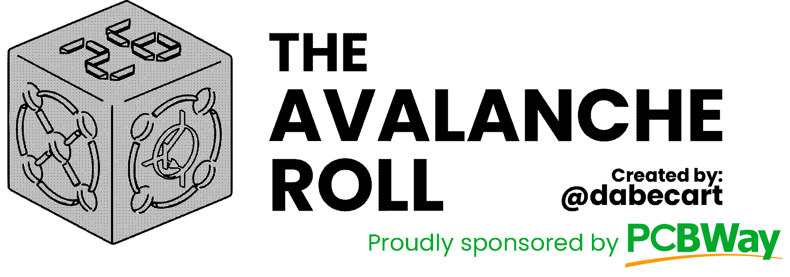
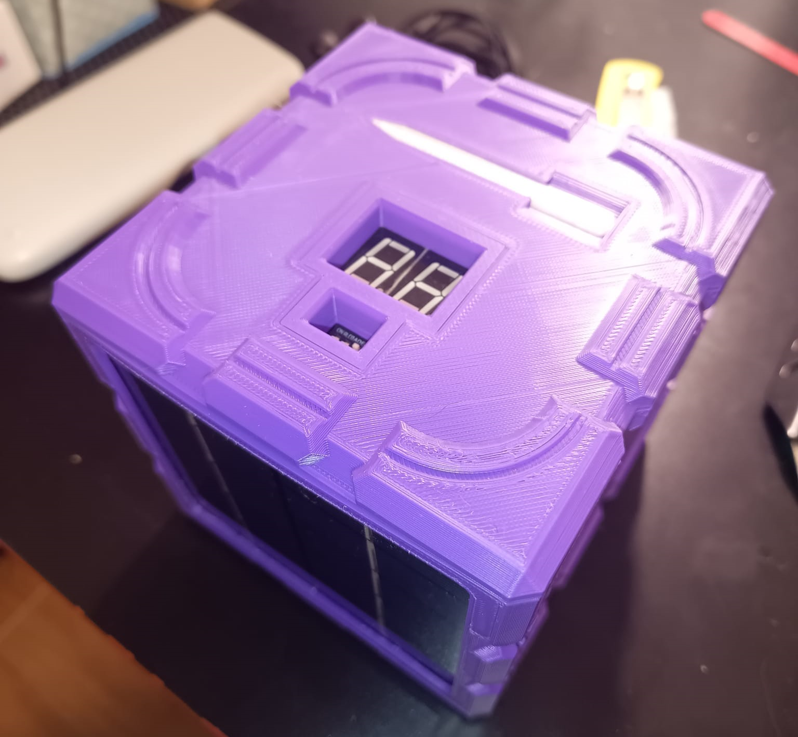

This project was sponsored by [**PCBWay**](#pcbway---pcb-manufacturing-and-assembly)!

# What's **THE AVALANCHE ROLL**?

The Avalanche Roll is the latest (_useless_) invention of @dabecart, and now there's [version 2.0 of this project](#the-avalanche-roll-v20)!

It's a space-graded truly-random and up to **D32** electronic dice that operates on a quantum operated phenomenon called **avalanche effect**!

Yes, you've heard it right, avalanche! That's where the name of this hunk of plastic and electronic comes… Genius, Daniel… Genius.

So, the avalanche effect happens when a N-P junction gets _reverse_ polarized, that is, when you try to force current over a diode on the opposite direction, from negative to positive. That, over a long period of time, causes a degrading of the diode, but in this case, we're looking for the exact point where the effect **starts** occurring.

You see, a diode generates a big voltage potential over its two ends when reverse polarized. Electrons cannot jump from one end to the other due to this potential; at least, not according to classical physics. Here comes the quantum part: there's an effect called **quantum tunneling** that actually allows the electrons to “appear” at the other side of the barrier, even though it's supposed to be impossible!

These jumps or magical apparitions are **truly random!** There's no way to calculate when the electrons are going to take the jump, and this is what makes this dice **really** random!

OK. And what about the **space-graded** part?

Well… This dice operates **without any microcontroller!** It's all analogic components and logic gates, meaning that this dice can go to outer space! (I think?) It's one of the requisites, but yeah, it could go to space (I think????).

Oh, and you can select the number of “faces” of the dice! Meaning you can ditch all your boring dices, because you've got one to rule over all!

“But @dabecart, going to space? If it's battery operated, how are you going to charge it?”

Glad you've asked it. It's got a **solar panel**. Yeah… It can also be charged using **USB-C**!

Useless. Over-engineered. Dubious quality. All seals of @dabecart work!

Hope you enjoy it!

# How to use

Please, refer to the [user guide](TheAvalancheRoll_UserGuide.pdf). Thanks!

# How to build it

1. Order (or build) the PCBs. You can find schematics and gerber files in the [PCB folder](PCB).
2. Once you have the PCBs, locate all elements on the boards. You can find a full BOM [here](BOM/TotalBOM.xlsx).
3. Print all the `stl` files. You can locate them [here](3d/stl).
4. Read the [assembly manual](TheAvalancheRoll_AssemblyManual.pdf) and done!

# The Avalanche Roll: v.2.0

When I first launched this project I was really surprised to be approached by the fine gentlemen at PCBWay to sponsor this project. Thanks to them:
- I have been able to fix some of the minor bugs I found on the first version of the dice, such as sporadic number bursts. 
- I've made the power board into a PCB! Yipee! 
- New look! I've also added new patters to the structure of the dice. Hope you like it!

# Photo album

Check the [Google Photos album](https://photos.app.goo.gl/XxesUJSZd3JCvjf18) with photos and a video of the project!

# PCBWay - PCB Manufacturing and Assembly

🌟 A Huge Thank You to PCBWay! 🌟

Thanks to PCBWay for their incredible support in bringing the second version of The Avalanche Roll to life. Whether you're a hobbyist, engineer, or student, I feel confident in saying that they're the go-to destination for high-quality PCB manufacturing and prototyping.

Here are just a few of the reasons why PCBWay stands out:

✅ Top-notch Quality: After thoroughly inspecting all of the PCBs of my project, I was content with the great precision the PCBs were made. I felt they are reliable and durable!

✅ Fast Turnaround: The whole ordering, manufacturing and shipping of 50 PCBs to Spain took around a week and a half, which is most impressing! 

✅ Affordable Pricing: Their competitive rates make professional-grade PCBs accessible to everyone. To give you an example, an Avalanche Roll PCB's took less than $5 to build, that is five different PCBs and I'm also counting the shipping, amazing!

✅ Excellent Support: From order placement to final delivery, PCBWay’s team was always there to answer my questions and provide guidance.

Thanks to their expertise and dedication, I was able to turn my ideas for this project into reality without a hitch. If you’re working on your next PCB project, I can’t recommend PCBWay enough!

🎉 Visit [**PCBWay.com**](https://www.pcbway.com/) and experience their amazing service for yourself!

# License
This project is licensed under MIT License. Read the [LICENSE file](LICENSE).